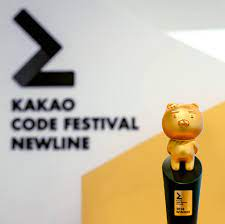
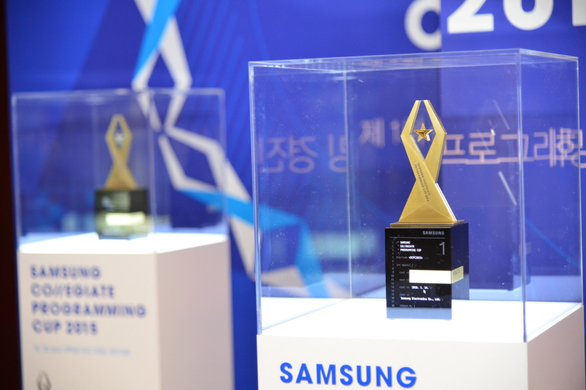

# Algorithmic-Problem-Solving

## Comments 

**06/04 Fri**  
- [Do it 자료구조와 함께 배우는 알고리즘 입문 JAVA](http://www.kyobobook.co.kr/product/detailViewKor.laf?ejkGb=KOR&mallGb=KOR&barcode=9791163030072&orderClick=LEa&Kc=)책 도서관 대출함 -> 자바 구현력 높이기 !!

- 백준 자료구조 유형 문제를 공략해보자!!

---  

## 6월 1일 1커밋 

[백준 알고리즘 사이트](https://www.acmicpc.net/school/ranklist/202) 경북대 랭킹 올려보기 ->6월,7월,8월 

## Java 종만북 

[프로그래밍 대회에서 배우는 알고리즘 문제 해결 전략(종만북), 구종만](https://book.algospot.com/) Java 문제풀이 

  

  
